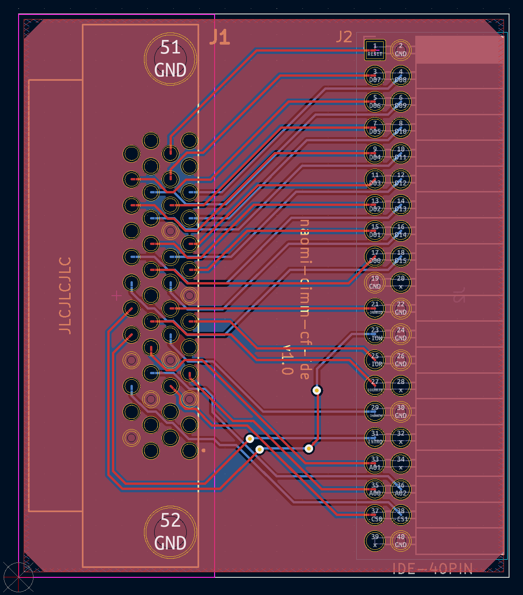

# naomi-dimm-cf-ide

## What

Personal project use on retro arcade games. to replace broken GD-ROM driver.

should works for sega's naomi dimm module with zerokey & cf-ide adapter.

## About

Based on [this wiki](https://wiki.pcbotaku.com/wiki/Sega_CF_box)

## Preview

## License

MIT
